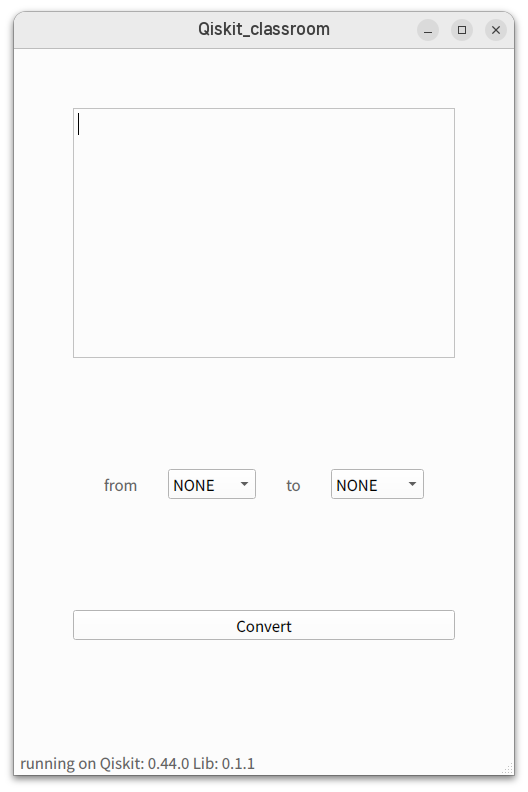
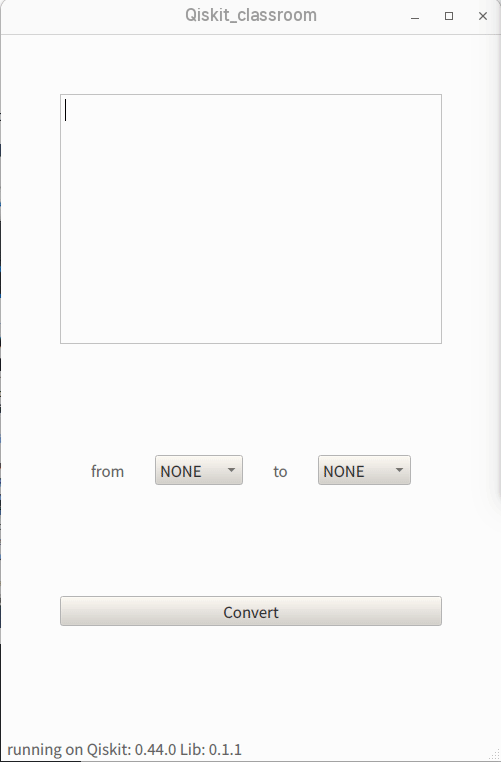
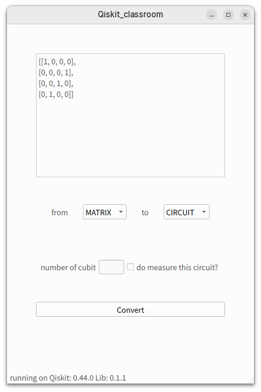

# Qiskit-Classroom

Qiskit-classroom is a toolkit that helps implement quantum algorithms by converting and visualizing different expressions used in the Qiskit escosystem using Qiskit-classroom-converter. The following three transformations are supported

* Quantum Circuit to Dirac notation

* Quantum Circuit to Matirx

* Matrix to Quantum Circuit

## Getting Started

### Prerequisites

* LaTeX distribution(or program) must be installed

  * On GNU/Linux recommend TeX Live

  * On Windows recomend MiKTeX

* git should be installed

* python must be installed (3.9 <= X <= 3.11)

* Qt6(>= 6.0.x) must be installed

### Install with Flatpak (GNU/Linux)

We currently packaging flatpak package. please wait for a couple of days

### Install with PyPi (Windows, MacOS)

We currently packaging python package. please wait for a couple of days.

> warning
>
> Apple silicon Processor not supported read this article

you must install latex distribution(program).

## How to Debugging

```bash
# download package
git https://github.com/KMU-quantum-classrooom/qiksit-classroom.git

# install python packages
cd qiskit-classroom
pip install -r requirements.txt

# run scripts
python -m main.py
```

## ScreenShots

* main window



* Quantum Circuit



It takes in the Python code and the names of the variables in the circuit you want to convert.
The Python code can be imported by dragging and dropping or by importing a file.

* Matrix



Takes in a matrix written in Python syntax, the number of qubits, and whether the circuit is observed or not.

## Acknowledgement

* 국문 : "본 연구는 2022년 과학기술정보통신부 및 정보통신기획평가원의 SW중심대학사업의 연구결과로 수행되었음"(2022-0-00964)

* English : "This research was supported by the MIST(Ministry of Science, ICT), Korea, under the National Program for Excellence in SW), supervised by the IITP(Institute of Information & communications Technology Planning & Evaluation) in 2022"(2022-0-00964)

## License

Qiskit-Classroom is licensed under the Apache License, Version 2.0
